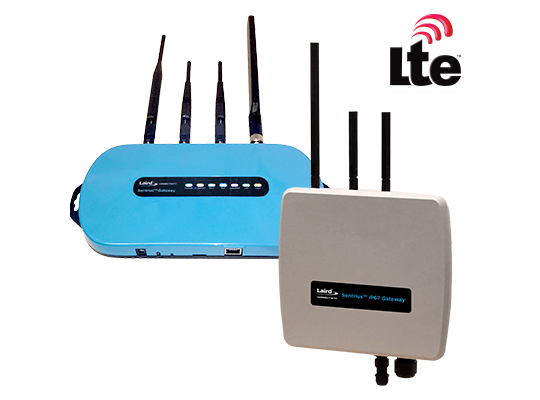

The **Laird Sentrius™ RG1xx** is a secure, scalable, robust LoRaWAN-Enabled Gateway that supports Wi-Fi, Ethernet, and LTE backends.

This page contains information about connecting the Laird Sentrius™ RG1xx to {}

<!--more-->

The technical specifications can be found in [Laird's official documentation](https://www.lairdconnect.com/wireless-modules/lorawan-solutions/sentrius-rg1xx-lorawan-gateway-wi-fi-ethernet-optional-lte-us-only#documentation). The Laird Sentrius™ RG1xx LoRaWAN Gateway supports two ways to connect with {}, using either the Semtech Packet Router or LoRa Basic Station.

## Requirements

1. User account on {} with rights to create gateways.
2. Laird Sentrius™ RG1xx LoRaWAN Gateway connected to the internet via ethernet or cellular.
3. A computer, tablet or mobile phone connected to the network (to configure the gateway).

## Registration

Create a gateway by following the instructions for the [Console]() or the [CLI]().

The **EUI** of the gateway can be found on the configuration web page of the gateway as **Gateway ID**, or on the bottom label as **DevEUI**.



## Configuration via Browser

The Laird Sentrius™ RG1xx LoRaWAN Gateway features a Wi-Fi quick config that allows you to configure it without connecting via ethernet. To expose the Wi-Fi access point, do the following:

1. Depress and hold the user button for 7 seconds.
2. From a wirelessly enabled device perform a scan.
3. Connect to the access point rg1xx29378B, where “29378B” are the last six digits of the Ethernet MAC address found on the label on the bottom of the gateway

> The network is secured with WPA2 with a password that is the same as the SSID.  It is recommended that the default password is changed for security reasons.  The password can be changed on the **Wi-Fi > Advanced** web page.

See [Laird's official documentation](https://www.lairdconnect.com/wireless-modules/lorawan-solutions/sentrius-rg1xx-lorawan-gateway-wi-fi-ethernet-optional-lte-us-only#documentation) for more information.

### Login

To log into the gateway web interface, follow these steps:

1. Determine the last three bytes of your gateway’s Ethernet MAC address. This can be found on the label on the bottom of the gateway; the last three bytes are highlighted
2. Enter the URL into the web browser to access the web interface. For example, for the gateway used in this guide, the URL is https://rg1xx29378B.local., where “29378B” are the last 6 digits of the Ethernet MAC address. In Wi-Fi quick config mode, the gateway can also be accessed via the IP address at https://192.168.1.1 
3. Accept the self-signed security certificate in the browser.
4. Log on using the following the default username **sentrius** and default password **RG1xx**





## Configure the Packet Forwarder

After completing basic configuration, follow the instructions for connecting using [{}]().
