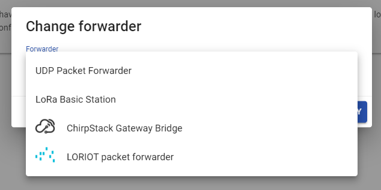
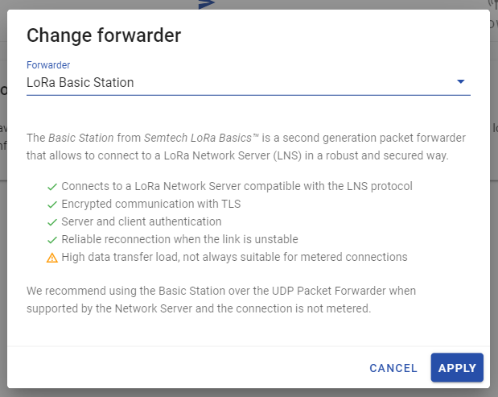
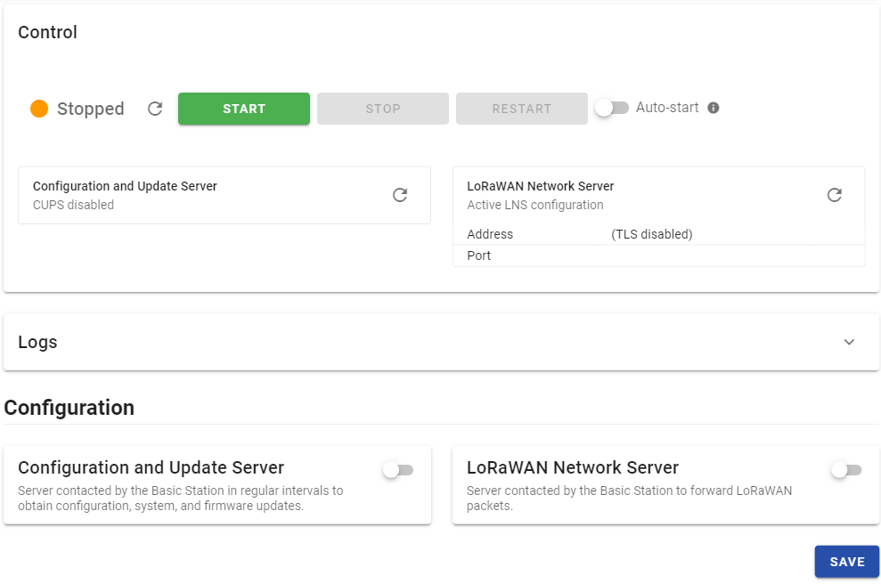
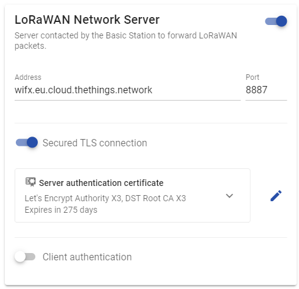
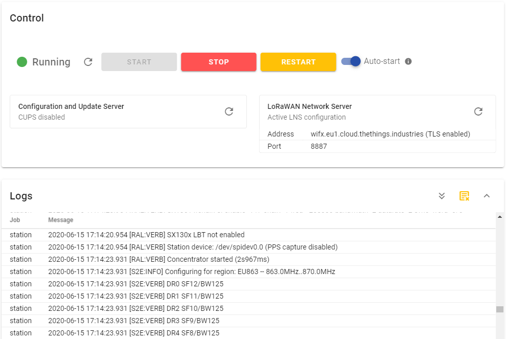

The LORIX One is a robust and professional grade outdoor LoRaWAN™ gateway in an ultra compact form factor, designed and assembled in Switzerland. The LORIX One supports ethernet, wireless, and cellular backhauls.

This page will guide you through the steps required to connect the gateway to {}.

<!--more-->


For additional help and technical specifications, please refer to [Wifx's official documentation](https://iot.wifx.net/docs).

## Requirements

  1. User account on {} with rights to create Gateways.
  2. A Wifx LORIX One running LORIX OS connected to the network
  3. A computer, tablet or mobile phone connected to the network (to configure the gateway)

If your gateway is running legacy software, please refer to [the official documentation](https://iot.wifx.net/docs) for upgrade instructions.

## Get the gateway EUI

To register the gateway, you will need its Extended Unique Identifier (Gateway EUI). This can be found either on the gateway's sticker or by software in the Manager UI.

### From the sticker

To get the Gateway EUI from the sticker, find the MAC address printed on the sticker under the gateway. The gateway EUI corresponds to the MAC address, removing the ';' and adding FFFE in the middle.

For example the MAC address

```
FC:C2:3D:AB:CD:EF
```

corresponds to a Gateway EUI of

```
FCC23DFFFEABCDEF
```

The full process for conversion is:
```
FC:C2:3D:AB:CD:EF => FCC23DABCDEF => FCC23D FFFE ABCDEF => FCC23DFFFEABCDEF
```

### From the Manager UI

To get the Gateway EUI from the Manager UI, connect to your gateway and check the **System > Information** page. Under the System section you will see the 'Serial number'. This serial number is the EUI.

## Registration

Create a gateway by following the instructions for the [Console]() or the [CLI]().

## Configuration

To connect to the LORIX One, open a web browser on your computer or device and enter the either the gateway hostname or the gateway IP address.

The hostname is `lorix-one-abcdef.local` where `abcdef` are the 6 last digits of the Gateway EUI.

> Note: hostname access is only available on networks that have mDNS enabled. On networks without mDNS, enter the IP address of the gateway in the web browser.

You will land on the login page. Log on using the following the default username **admin** and default password **lorix4u**.



### Configure the antenna type

Go to the **LoRa > Settings page > Hardware tab**.


In the **Antenna** field, select the antenna you have connected.

- 2dBi is the small antenna (~20cm)
- 4dBi is the big antenna (~40cm)

> Note: if the antenna type is not configured, the packet forwarder will fail to start.

### Configure the packet forwarder

#### Use Basic Station as a packet forwarder

Go to the **LoRa > Settings page > Forwarder tab**.



On the top right, click the **Edit** button to choose a forwarder.



In the list, select **LoRa Basic Station** and press apply.



On the new page, scroll down to the **LoRaWAN Network Server** section and enable it.



Follow the instructions for [Connecting LNS]().

If using CUPS, following the instructions for [Connecting CUPS]().



Press the **save** button. In the **Control** pane above, press **start** and check the logs in the dedicated pane.



You should see a bunch of messages, one of which indicates success :

```log
[TCE:INFO] Infos: fcc2:3dff:feab:cdef muxs-::0 wss://wifx.eu1.cloud.thethings.industries:8887/traffic/eui-FCC23DFFFEABCDEF
```

If the connection fails, you will get this kind of message:

```log
[AIO:ERRO] [-1] WS connect failed: NET - Failed to get an IP address for the given hostname
[TCE:ERRO] TC connect failed - URI: wss://wrong-tenant.eu1.cloud.thethings.industries:8887
```

Please check the configuration and the **LoRa Network Server** status. After a configuration change, always restart the Basic Station with the **Restart** button to make it effective.

> Note: if the Basic Station crashes for any reason, it will be automatically restarted if the **Auto-start** option is enabled.

#### Use the UDP Packet Forwarder as a packet forwarder

You can use the UDP Packet Forwarder as an alternative to Basic Station to connect to the network server.

Select the **UDP Packet Forwarder** in the forwarder selection list

In the **Configuration** pane, click **Edit** (blue button with a pencil)

On the **Global** tab of the configuration editor, set the following configuration:

1. **Address**: Address of the Gateway Server. If you followed the [Getting Started guide]() this is the same as what you use instead of `thethings.example.com`.
2. **Up port**: UDP upstream port of the Gateway Server, typically `1700`.
3. **Down port**: UDP downstream port of the Gateway Server, typically `1700`.


Save the configuration and start the packet forwarder.

> Note: the UDP Packet Forwarder does not correctly handle unstable connectivity and has no security.
